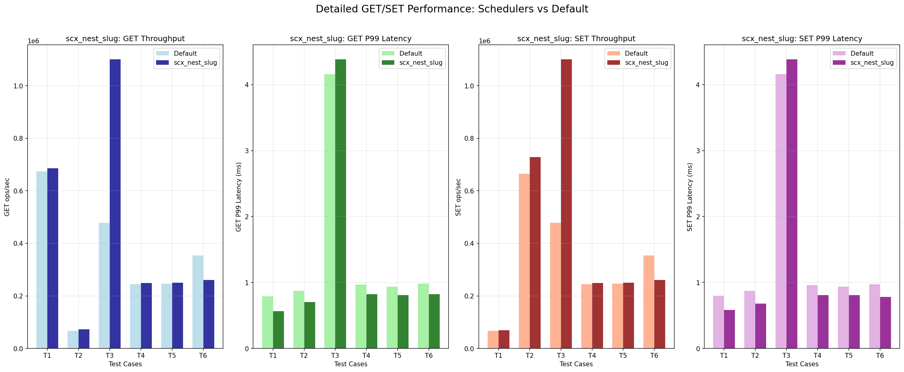

# SCX Redis Scheduler Analysis

## Looking at `scx_nest` for Redis

- Repo: `schedcp`
- Workload data source: `workloads/redis/results/`
- Main question: when does an `scx` scheduler help Redis, and which one tells the strongest story?

---

# Executive Summary

- `scx_nest` is the best scheduler to present for Redis in this repo if the story is "balanced improvement with a clear scheduling idea."
- It is not the universal winner across every Redis benchmark.
- For memtier-style mixed workloads, `scx_nest` improves average throughput by about `+6.4%` and average P99 latency by about `-5.5%` versus default.
- Its biggest wins are pipelined and sequential patterns.
- Its weakest cases are read-heavy and write-heavy mixes.

---

# Why `scx_nest` Is Interesting

- `scx_nest` is a warm-core packing scheduler.
- It concentrates work on a compact set of active cores to keep those cores at higher frequency.
- That design fits Redis reasonably well when the workload benefits from:
  - cache locality,
  - fewer migrations,
  - high single-core or small-core-group boost,
  - bursty or moderately parallel request handling.

Source:
- [scheduler/sche_description/scx_nest.md](/root/schedcp/scheduler/sche_description/scx_nest.md:1)

---

# Benchmark Setup In This Repo

- Redis benchmark suite:
  - `redis-benchmark`
  - results in `redis_scheduler_results.json`
- Memtier benchmark suite:
  - `memtier_benchmark`
  - results in `memtier_scheduler_results.csv`
- Redis server config in the tests:
  - `io_threads=64` for `redis-benchmark`
  - `io_threads=32` in memtier summary
  - `io_threads_do_reads=yes`
  - `maxmemory=256gb`

Source files:
- [workloads/redis/redis_bench_start.py](/root/schedcp/workloads/redis/redis_bench_start.py:1)
- [workloads/redis/README.md](/root/schedcp/workloads/redis/README.md:1)
- [workloads/redis/results/summary_memtier.txt](/root/schedcp/workloads/redis/results/summary_memtier.txt:1)

---

# Broad Scheduler Landscape

## `redis-benchmark` average across Redis micro-ops

- `scx_userland`: `+14.3%` throughput vs default, but `+349.4%` worse average P99
- `scx_lavd`: `+7.4%` throughput, but `+41.5%` worse average P99
- `scx_nest`: `+4.7%` throughput, but `+19.4%` worse average P99
- `scx_layered`: `+3.4%` throughput, with `+8.9%` worse average P99
- `scx_mitosis`: `-2.4%` throughput, but `-9.3%` better average P99

## Memtier average across mixed-client patterns

- `scx_mitosis`: `+14.1%` throughput, `-2.1%` better average P99
- `scx_layered`: `+12.9%` throughput, `+6.8%` worse average P99
- `scx_nest`: `+6.4%` throughput, `-5.5%` better average P99

Takeaway:
- `scx_nest` is not the raw throughput champion, but it is one of the cleanest throughput/latency trade-offs.

---

# Why Not Present `scx_userland` As The Redis Winner?

- It leads the `redis-benchmark` micro-op average throughput.
- But its average P99 latency is dramatically worse than default.
- That makes it harder to defend for a Redis presentation unless the audience only cares about peak microbenchmark throughput.

Pragmatic framing:
- If the presentation is about "best raw micro-op throughput," mention `scx_userland`.
- If the presentation is about "credible scheduler for real Redis service behavior," `scx_nest` is the better anchor.

---

# `scx_nest` vs Default On Memtier

## Repo summary numbers

- Overall throughput: `1,882,869 ops/sec` vs `1,753,086 ops/sec`
  - `+7.4%` for `scx_nest`
- Overall P99 latency: `5.86 ms` vs `6.23 ms`
  - `-6.0%` for `scx_nest`

## Pattern-by-pattern

- Read heavy:
  - throughput `-22.1%`
  - P99 `-14.5%` better
- Write heavy:
  - throughput `-15.6%`
  - P99 `+4.3%` worse
- Pipeline 16:
  - throughput `+69.1%`
  - P99 `-37.1%` better
- Sequential:
  - throughput `+150.4%`
  - P99 `-7.4%` better
- Advanced Gaussian random:
  - throughput `+13.5%`
  - P99 `+15.7%` worse

Source:
- [workloads/redis/results/summary_memtier.txt](/root/schedcp/workloads/redis/results/summary_memtier.txt:1)

---

# Memtier Figure

Suggested talking point:
- "`scx_nest` is not uniformly better. Its value is concentrated in balanced, pipelined, and sequential cases, where warm-core packing and locality help more than wide spreading."

---

# Redis Benchmark Figures

Suggested talking point:
- "The microbenchmark landscape is noisier. Several schedulers can beat default on throughput, but many pay with worse tail latency. `scx_nest` stays in the competitive set without the most extreme latency penalty."

---

# Recommended Story For The Presentation

## Position `scx_nest` as:

- a scheduler with a clear mechanism,
- a balanced Redis candidate,
- especially good for pipeline-heavy and sequential access patterns,
- not the right choice for every Redis deployment.

## One-sentence message

`scx_nest` improves Redis when request handling benefits from warm-core packing and locality, but read-heavy and write-heavy mixes may prefer a different scheduler or the default kernel scheduler.

---

# Risks And Caveats

- These results come from benchmark suites, not a production Redis service with real tenant mix.
- Redis behavior differs between:
  - micro-op throughput tests,
  - mixed-client memtier tests,
  - production tail latency under background noise.
- The `scx_nest` design itself is documented as best on single-socket / single-CCX style hardware assumptions.
- If you present `scx_nest` as "the best Redis scheduler," the repo data does not fully support that claim.

---

# Recommended Next Experiments

- Re-run memtier with the exact production traffic mix.
- Collect CPU frequency, migrations, and LLC miss data while testing `scx_nest`.
- Compare `scx_nest` directly against:
  - `default`
  - `scx_mitosis`
  - `scx_layered`
  - `scx_userland`
- Add service-level metrics:
  - throughput
  - P99 and P99.9 latency
  - CPU utilization
  - fairness under contention

---

# Appendix: Useful Repo Artifacts

- [workloads/redis/results/summary_memtier.txt](/root/schedcp/workloads/redis/results/summary_memtier.txt:1)
- [workloads/redis/results/memtier_scheduler_results.csv](/root/schedcp/workloads/redis/results/memtier_scheduler_results.csv:1)
- [workloads/redis/results/redis_scheduler_results.json](/root/schedcp/workloads/redis/results/redis_scheduler_results.json:1)
- [workloads/redis/results/memtier_detailed_comparison.png](/root/schedcp/workloads/redis/results/memtier_detailed_comparison.png)
- [workloads/redis/results/redis_throughput_comparison.png](/root/schedcp/workloads/redis/results/redis_throughput_comparison.png)
- [workloads/redis/results/redis_latency_comparison.png](/root/schedcp/workloads/redis/results/redis_latency_comparison.png)
